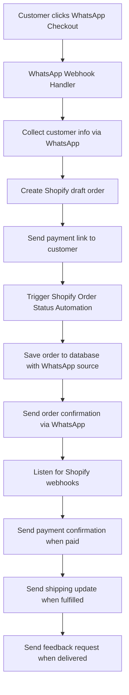

# WhatsApp + Shopify Integration Guide

This guide explains how the WhatsApp checkout automation integrates with the Shopify order status automation to create a seamless customer experience.

## 🔄 Complete Flow Definition

### 1. WhatsApp Checkout Flow (Custom Flow)

When the user clicks "WhatsApp Checkout" on the website or in WhatsApp:

1. **Customer Identification**
   - Check if the user exists in the CRM (by phone number)
   - If not, start onboarding (ask for name, address, pincode, etc.) step-by-step in WhatsApp
   - Save responses in Firestore/MySQL session

2. **Order Summary Display**
   ```
   🧾 *Order Summary*
   Product: Vaclav Exotic Handbag
   Quantity: 1
   Total: ₹2,499
   ```

3. **Order Confirmation**
   - Ask for confirmation (✅ Confirm / ❌ Cancel)
   - On confirmation:
     - Create a temporary order record in the backend (status: pending_payment)
     - Generate:
       - a Shopify checkout URL
       - a Payment link

4. **Notification with Action Buttons**
   - Send an order_confirmation WhatsApp template message with two buttons:
     - 💳 Pay Now → opens the payment link
     - 🛍️ View Summary → opens the Shopify checkout page

### 2. Shopify Order Status Automation

When the order is created in Shopify (via API or checkout link), the existing Shopify automation automatically triggers:

1. **Order Created** → Send order confirmation message
2. **Order Paid** → Send payment confirmation message
3. **Order Fulfilled** → Send shipping update
4. **Order Delivered** → Send feedback request

## 🔗 Integration Notes

### Unified Order Record

All orders (both WhatsApp and Shopify) are stored in a single `orders` collection with:

- `source`: "whatsapp" or "shopify"
- `status`: "pending_payment", "paid", "fulfilled", "delivered"
- `shopify_order_id`
- `phone`
- `trace_id` (for logging)

### Sync Triggers

When WhatsApp Checkout creates the order in Shopify, the system automatically calls:

```javascript
triggerShopifyOrderStatusAutomation(shopify_order_id, customer_phone);
```

This function initializes the same webhook-driven flow used for normal Shopify orders.

### Error Tolerance

If order creation fails or webhook doesn't fire:
- System logs the error in `order_activity_log`
- Admin receives an error notification
- Manual trigger option available

## 🧠 Implementation Details

### Key Components

1. **WhatsApp Webhook Handler** (`routes/webhook/whatsapp.js`)
   - Processes incoming WhatsApp messages
   - Manages the checkout conversation flow
   - Creates Shopify orders
   - **NEW**: Triggers Shopify automation after order creation

2. **Shopify Webhook Handler** (`routes/webhook/shopify.js`)
   - Processes Shopify events (order created, paid, fulfilled, etc.)
   - Sends appropriate WhatsApp notifications
   - **ENHANCED**: Handles WhatsApp-originated orders without duplicate notifications

3. **Automation Trigger** (`lib/shopifyOrderAutomationTrigger.js`)
   - **NEW**: Central function to trigger Shopify automation for WhatsApp orders
   - Saves order to database with proper metadata
   - Sends initial confirmation message
   - Logs all activities

### Data Flow



## 🧩 Outcome

✅ When a customer completes a WhatsApp checkout:

1. Their order is created in Shopify
2. Automatically, the Shopify automation picks up from there and sends:
   - Order Confirmation
   - Payment Success
   - Shipment Update
   - Delivery Feedback

All via WhatsApp — with zero manual linking required.

## 🛠️ Technical Implementation

### Triggering Shopify Automation

The key enhancement is in the `processCheckoutOrder` function in `routes/webhook/whatsapp.js`:

```javascript
// After creating the Shopify order
await triggerShopifyOrderStatusAutomation(db, integrations, draftOrder.id.toString(), from);
```

This ensures that WhatsApp orders follow the same automation path as regular Shopify orders.

### Preventing Duplicate Notifications

The Shopify webhook handler now checks the order source:

```javascript
const isWhatsAppOrder = order.tags && order.tags.includes('whatsapp-checkout');

// For WhatsApp orders, skip the initial confirmation to avoid duplicates
if (!isWhatsAppOrder && orderData.customerPhone) {
  // Send confirmation
}
```

### Unified Order Status

All orders now use a unified `status` field in addition to the specific `financialStatus` and `fulfillmentStatus` fields, making it easier to track order progress across both flows.

## 📊 Logging and Monitoring

All automation activities are logged in the `order_activity_log` collection:

- WhatsApp order creation
- Automation trigger events
- Notification sends
- Errors and failures

This provides complete visibility into the automation process for debugging and optimization.

## 🔧 Configuration

The integration uses the existing configuration in `config/index.js` and the integration settings stored in the `integrations` collection in the database.

No additional configuration is required for the basic integration to work.

## 🚀 Testing

To test the integration:

1. Initiate a WhatsApp checkout from the website
2. Complete the information collection process in WhatsApp
3. Confirm the order in WhatsApp
4. Verify that:
   - Order is created in Shopify
   - Order confirmation is sent via WhatsApp
   - Order appears in the database with `source: "whatsapp"`
   - Automation logs are created
   - Subsequent Shopify events trigger appropriate WhatsApp notifications

## 🆘 Troubleshooting

Common issues and solutions:

1. **Duplicate notifications**: Check that the `whatsapp-checkout` tag is properly applied to orders
2. **Missing phone numbers**: Ensure customer phone is collected during checkout
3. **Automation not triggering**: Check the `order_activity_log` for errors
4. **Shopify API errors**: Verify Shopify credentials and permissions

## 📈 Future Enhancements

Potential improvements for future versions:

1. **Retry mechanism**: Implement automatic retries for failed automation triggers
2. **Admin dashboard**: Create UI to monitor WhatsApp orders and automation status
3. **Advanced analytics**: Track conversion rates and customer journey metrics
4. **Multi-language support**: Localize WhatsApp messages based on customer preferences