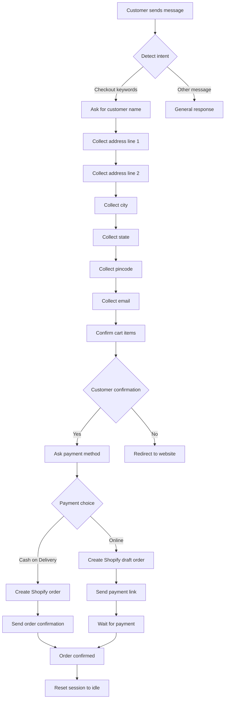
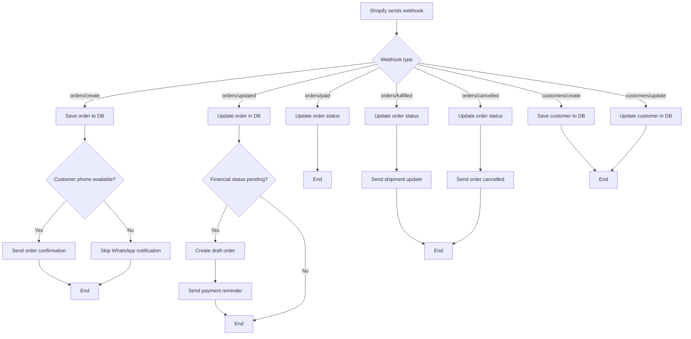
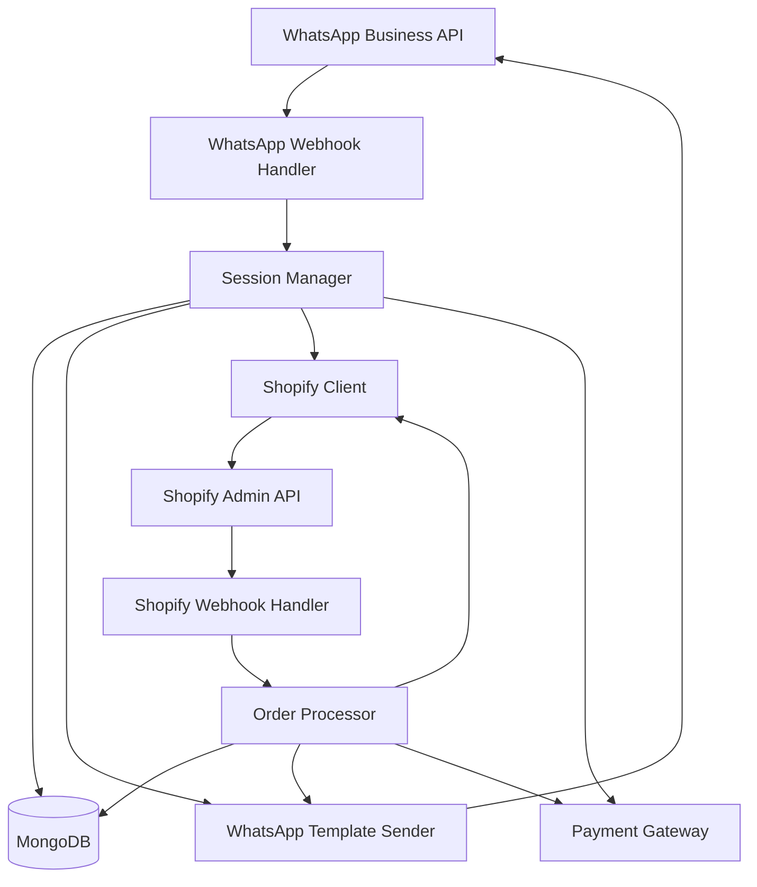
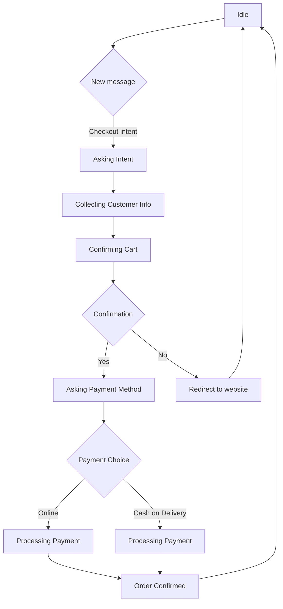
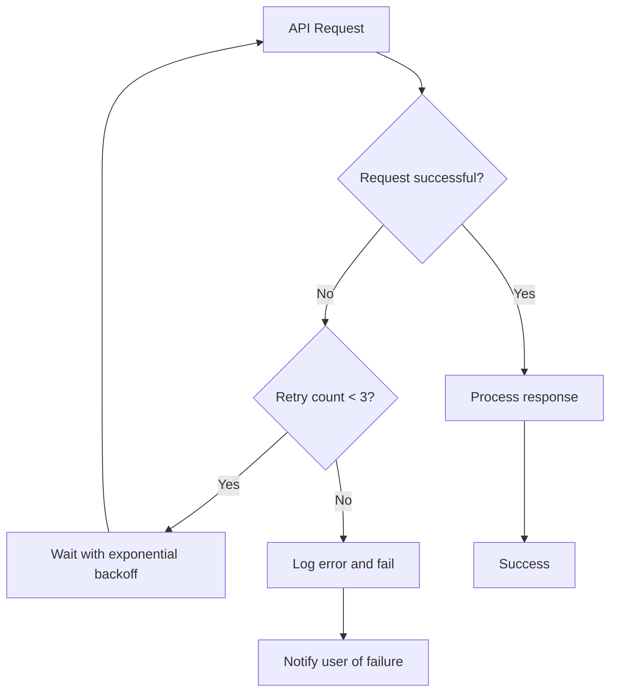

# WhatsApp Commerce Hub - Flow Diagrams

## 1. WhatsApp Checkout Flow

## 2. Shopify Webhook Flow

## 3. System Architecture

## 4. Conversation State Management

## 5. Error Handling and Retry Logic

## Component Descriptions

### WhatsApp Webhook Handler
- Processes incoming WhatsApp messages
- Manages conversation flow states
- Integrates with session management
- Sends templated responses

### Shopify Webhook Handler
- Processes Shopify order events
- Updates database with order information
- Sends WhatsApp notifications based on events
- Handles customer data synchronization

### Session Manager
- Manages user conversation states
- Handles session timeout and cleanup
- Stores customer information during checkout
- Provides session persistence

### Shopify Client
- Wrapper for Shopify Admin API
- Handles authentication and requests
- Provides methods for orders, products, and webhooks
- Includes error handling and retry logic

### Payment Gateway
- Integrates with multiple payment providers
- Creates payment links for online payments
- Handles payment status updates
- Supports both Shopify and external payment processors

### WhatsApp Template Sender
- Sends templated WhatsApp messages
- Implements retry logic for failed sends
- Handles WhatsApp API errors
- Provides methods for different message types

## Data Flow

1. **WhatsApp Checkout Flow**:
   - Customer initiates conversation with checkout intent
   - System collects customer information step-by-step
   - Customer confirms cart items
   - Customer selects payment method
   - System creates order in Shopify
   - System sends payment link or order confirmation
   - Order status updates trigger WhatsApp notifications

2. **Shopify Webhook Flow**:
   - Shopify sends order event webhooks
   - System processes and stores order data
   - System sends WhatsApp notifications based on event type
   - Customer responses trigger further actions

## Error Handling

- All API calls include retry logic with exponential backoff
- WhatsApp "not in allowed list" errors are handled with specific user guidance
- Shopify API errors are logged and retried
- Database operations include proper error handling
- Session timeouts are managed automatically